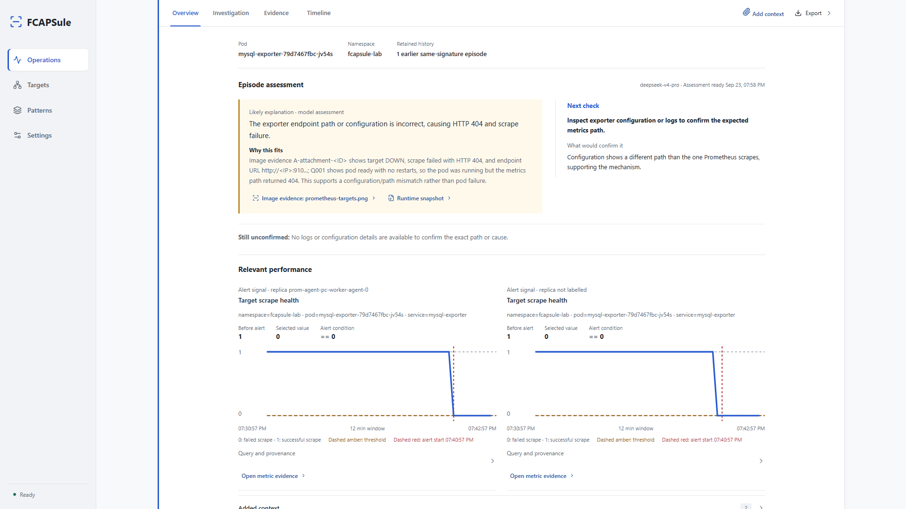
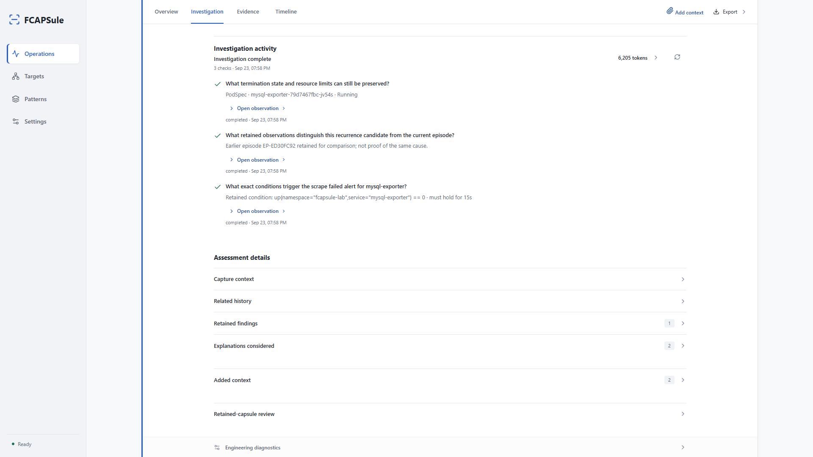

# FCAPSule

**An AI investigator for the observability stack you already have, with a memory of past incidents.**

An alert tells a monitoring team that something is wrong. The explanation is usually scattered across logs, metrics, workload configuration and earlier incidents, often in systems with different retention windows. FCAPSule joins those observations around the incident, lets a bounded AI investigator ask follow-up questions, and preserves the evidence and reasoning in an inspectable capsule.

When a related problem returns, the investigator can consult eligible earlier capsules. It remembers through retained evidence, not by changing model weights. That distinction matters: the engineer can inspect what was captured, what the model inferred and what is still unknown.

**The result is investigation continuity:** from the first alert, through a human review, to a future recurrence after the original source window may have expired. FCAPSule complements Prometheus, OpenSearch and Kubernetes; it does not replace them.



## Why It Matters

- **An investigator, not another summary.** After bounded deterministic capture, the model can choose read-only checks, examine their observations, compare explanations and propose a next action with an expected finding. Checks, citations, uncertainty and token use remain reviewable.
- **Several signals, one incident.** Prometheus alerts (or optional Grafana webhooks), time series, OpenSearch logs, and Kubernetes workload/configuration facts are aligned to the affected resource. Pod identity is preferred; configured labels such as CNFC/VNFC can scope an alert to several replicas. Related alerts form an episode without losing their individual reports.
- **A memory an engineer can audit.** Selected evidence, completed checks and provenance survive in a retained capsule. Patterns exposes recurrence; an eligible earlier capsule can inform a later investigation even when its original telemetry is no longer searchable.
- **A place for the missing clue.** An engineer may add text, an external screenshot or an audio note. Optional vision and transcription models turn supplied media into attributable observations for a reviewed reassessment.
- **A new retention option to evaluate.** Preserving compact incident evidence can extend investigative context beyond raw-source retention. It does not recover data that was never captured or justify reducing source retention without measuring the result.

For the full product narrative, see [Observability With Memory](docs/product_value_proposition.md). The screenshots use synthetic Lab incidents, not production performance claims.

## The Operator Workflow

1. Configure and test Prometheus, OpenSearch and Kubernetes access in **Targets**. Coverage shows currently observed workloads by namespace. Optionally map alert IDs to pod labels or enable the authenticated Grafana webhook.
2. A firing alert opens a bounded capture. FCAPSule preserves selected fault, performance, log and configuration evidence and builds a report even if the model provider is unavailable.
3. **Operations** presents the episode, affected resource, observed impact and AI investigation. Follow citations into the captured evidence or the investigator's checks; add evidence or export the report when needed.
4. **Patterns** shows recurring issues and links back to separate episodes. An eligible earlier capsule can become bounded context for a new investigation.
5. **Settings** controls FCAPSule incident retention and model configuration. Offline model comparisons remain an evaluation workflow, not an operator dashboard.



The model's assessment is a supported hypothesis, not a certified root cause or an executed fix. The investigator only uses allowlisted read-only checks; it does not reproduce workloads or remediate systems. See [AI investigation techniques](docs/ai_investigation_techniques.md) for the actual tools, budgets and validation limits.

## Evidence and Memory

Each FCAPSule instance retains its own capsules and uses conservative same-instance
history. A separate, opt-in **FCAPSule Atlas** service can share compact cases
across participating instances; it is disabled by default and does not replace
local history or turn a similar case into a shared-cause finding. See the
[FCAPSule Atlas guide](docs/ATLAS.md) for its privacy boundary, current API,
operator limits and evaluation plan.

| Source | What FCAPSule uses today |
| --- | --- |
| Prometheus | Firing alerts, matching rule conditions where available, and bounded metric windows |
| OpenSearch | Incident-window logs, grouped into patterns with representative masked examples |
| Kubernetes API | Workload identity, pod state, topology and referenced ConfigMaps; not Secrets |
| Earlier FCAPSule capsules | Eligible retained observations and investigation records, with earlier conclusions kept distinct from evidence |
| Operator-supplied media | Optional text, image and audio evidence after the relevant model capability is configured |

The live integration does not query a trace backend. Imported cases may declare trace availability, but raw spans are not retained. Source systems remain authoritative. FCAPSule currently also stages bounded raw live inputs on its state volume until incident cleanup; a derived ZIP excludes those inputs but may still contain sensitive selected examples. See [privacy and retention](docs/data_privacy.md).

## Start Locally

Requirements: Python 3.11+. From this repository:

```bash
python3 -m venv .venv
source .venv/bin/activate
python -m pip install -e .
python -m fcapsule.cli serve
```

Open `http://127.0.0.1:8765/console`. Targets, Patterns and Settings are linked in the UI. On Windows PowerShell, activate with `.venv\Scripts\Activate.ps1`. No external source is connected until configured in Targets or through environment variables. The CLI works without the web interface.

To deploy the single-replica reference service in Kubernetes, follow the [Kubernetes guide](docs/kubernetes_deployment.md). It uses read-only Kubernetes access, a persistent state volume and configurable Prometheus/OpenSearch URLs. FCAPSule Lab is a [separate workload project](https://github.com/Hi-io/fcapsule-lab), not a runtime dependency.

## CLI and Evaluation

```bash
python -m fcapsule.cli status
python -m fcapsule.cli ingest-case --case /path/to/normalized-case --app-id payments-api --app-name "Payments API"
python -m fcapsule.cli investigate --case /path/to/normalized-case --out ./.fcapsule/capsules/example
```

Offline comparison uses the same capsule input for each selected model. It is useful for testing provider choice, latency, token use and answer quality without turning the operator console into a benchmark:

```bash
python -m fcapsule.cli compare-llms --capsule ./.fcapsule/capsules/<incident-id>/capsule.json --out ./.fcapsule/capsules/<incident-id> --models deepseek-v4-flash deepseek-v4-pro
```

See [provider operations](docs/llm_provider_operations.md), [evaluation plan](EVALUATION_PLAN.md) and the [data schema](DATA_SCHEMA.md) for configuration and contracts. Never commit provider keys or captured telemetry.

## Current Boundaries

FCAPSule is working single-replica software for a trusted environment, not an Internet-facing managed service. The reference HTTP server has no built-in authentication, authorization or TLS; SQLite and in-process workers are not distributed. Masking is heuristic, not a guarantee of anonymization. Historical matching is deliberately conservative and cannot equate every failure across changed workloads. Investigation quality still requires review on real incidents.

Cross-instance case sharing through Atlas is a distinct, optional integration.
It is disabled by default and requires a separately deployed service. The current
service uses a single shared bearer token without per-instance authorization, and
has no remote delete endpoint or automated case-retention policy. Do not treat it
as a production multi-tenant service. Local incident capture and investigation
must remain useful when Atlas is unavailable.

The [roadmap](ROADMAP.md) covers production hardening, source scaling, durable workers and broader evaluation. No measured storage-cost reduction, diagnosis accuracy or industry-first claim is implied by the product narrative.

## Verify and Explore

```bash
python -m unittest discover -s tests -v
node --check fcapsule/ui/assets/app.js
node --test tests/ui_*.test.cjs
```

Node is needed for frontend tests, not to run the service. Start with the [documentation index](docs/README.md) for current operating guides, implementation details, research framing and clearly separated historical records. FCAPSule is [MIT licensed](LICENSE).
