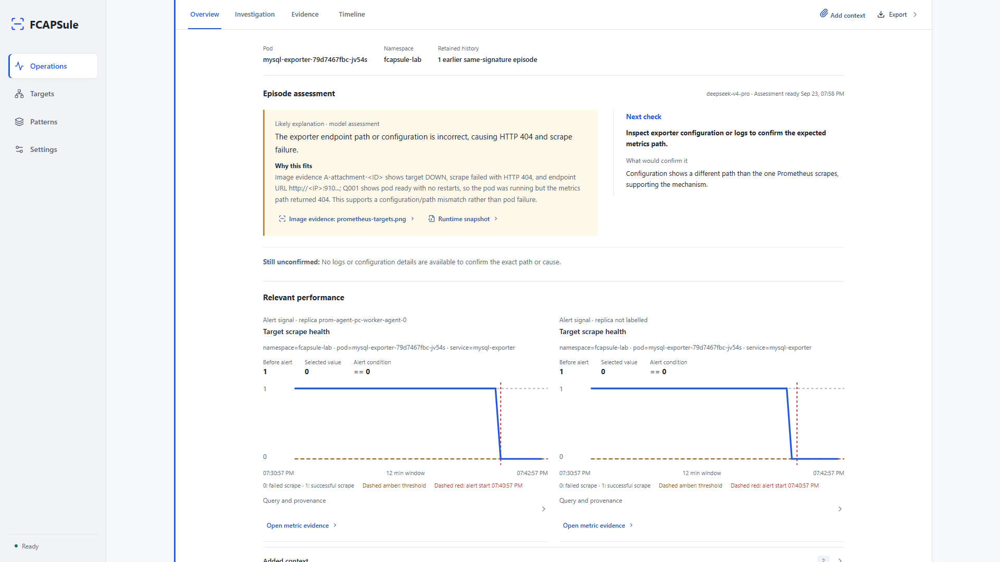
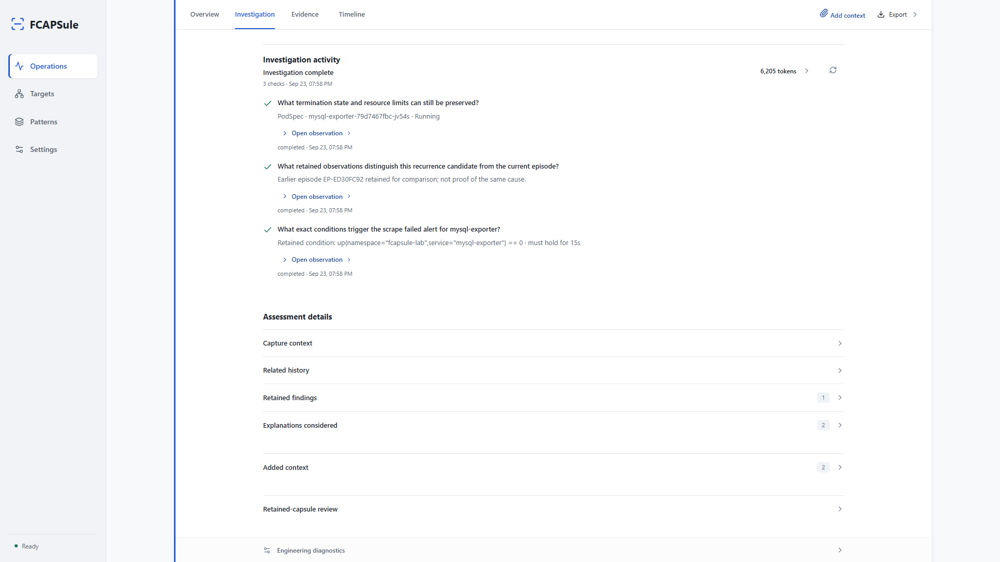

# FCAPSule

**FCAPSule investigates; Collective remembers.** AI-assisted incident investigation, durable evidence capsules and shared operational knowledge for an existing observability stack.

An alert identifies a symptom. Explaining it often requires joining logs, metrics, configuration and earlier incidents before their source retention expires. FCAPSule brings this evidence into one investigation, uses an AI agent to select targeted read-only checks, and preserves the findings with their supporting observations. An engineer can add a screenshot or spoken observation and review the resulting assessment alongside its earlier revision.

With **Collective**, participating FCAPSule instances share selected incident knowledge. Experience from one deployment can direct checks in another, while each instance keeps its own evidence, model configuration and investigation costs.



## V1 Capabilities

- **Investigate across sources.** Correlate Prometheus alerts and metrics, OpenSearch logs and Kubernetes workload/configuration facts. Optional Grafana webhooks use the same capture workflow.
- **Group related work.** Combine alert signals into episodes using workload identity and occurrence time. Configurable resource labels, such as a cloud-native function component (CNFC) identifier, support investigations spanning several replicas.
- **Ask targeted questions.** The agent examines retained evidence, selects bounded source checks and returns a cited explanation, alternatives and a useful next action.
- **Preserve incident context.** Selected evidence and completed checks remain inspectable after the original source window expires. Capsules can be exported and imported for later review.
- **Use multimodal evidence.** Configurable visual and speech models extract observations from operator-supplied screenshots and recordings for a revised investigation.
- **Reuse operational knowledge.** Local history supports recurrence analysis; the optional Collective service makes selected experience available across instances.

## Start Locally

Requirements: Python 3.11 or later. Install from the checked-out revision:

```bash
python3 -m venv .venv
source .venv/bin/activate
python -m pip install -e .
python -m fcapsule.cli serve
```

On Windows PowerShell, activate with `.venv\Scripts\Activate.ps1` instead. Open `http://127.0.0.1:8765/console`.

1. Configure source access and workload scope in **Targets**, then test the connections.
2. Select and validate the investigator's provider/model in **Settings**. Credentials can be supplied there or through `DEEPSEEK_API_KEY` / `OPENROUTER_API_KEY`.
3. Open an episode in **Operations** to inspect the assessment, checks and retained evidence.
4. Use **Patterns** for local recurrence or connect **Collective** for shared knowledge.

Capture and deterministic reports also work without model credentials. To inspect the included offline fixture:

```bash
python -m fcapsule.cli investigate \
  --case tests/fixtures/checkout_dependency_failure \
  --out .fcapsule/capsules/example
```



## Documentation

| Document | Contents |
| --- | --- |
| [Operations](docs/operations.md) | Sources, models, investigation workflow, media, capsule import/export and deletion |
| [Architecture](docs/architecture.md) | Evidence processing, the agent loop, local history, shared knowledge and implementation map |
| [Kubernetes deployment](docs/kubernetes_deployment.md) | Installation, source permissions, HTTPS, credentials and version-pinned updates |
| [Collective](docs/collective.md) | Connect independent instances, publish/retrieve cases and manage shared records |
| [Data contracts](DATA_SCHEMA.md) | Normalized input, retained evidence, investigation records and archive format |
| [Privacy and retention](docs/data_privacy.md) | Storage boundaries, external disclosures, credentials and record lifecycle |
| [Evaluation](docs/evaluation.md) | Automated verification, comparison methods and the recorded validation cited in the report |

The [Collective service](https://github.com/Hi-io/collective) and [FCAPSule Lab](https://github.com/Hi-io/fcapsule-lab) have separate repositories. Collective is optional; the Lab provides controlled workloads for evaluation and is not a runtime dependency. Screenshots above show Lab incidents.

## Deployment Scope

V1 runs as a single FCAPSule instance with persistent local state, alongside existing observability sources. The supplied adapters target Prometheus, Filebeat-style OpenSearch documents and Kubernetes; other integrations can supply the same normalized case contract. The investigator runs allowlisted read-only checks, not remediation.

Keep the console on a trusted network: login is disabled by default. Remote access requires an appropriate HTTPS and access-control boundary; optional Basic Auth is documented in the deployment guide. Review the privacy guide before enabling external models or shared-memory publication. Source telemetry, retained capsules and published Collective cases have separate lifecycles.

## Verification

```bash
python -m unittest discover -s tests -v
node --check fcapsule/ui/assets/app.js
node --check fcapsule/ui/assets/estima.js
node --test tests/ui_*.test.cjs
```

Node is required for frontend tests, not for running the service. FCAPSule is [MIT licensed](LICENSE).
