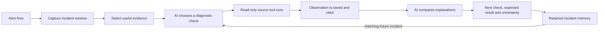
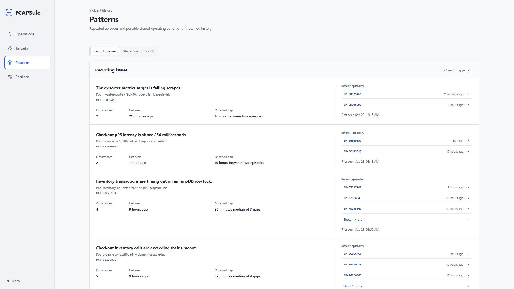

# Your Telemetry Expires. Your Operational Memory Shouldn't.

**FCAPSule is an AI-powered incident memory layer for teams that cannot keep every log, metric and event searchable forever.** It captures the evidence around an incident while it is available, gives an AI investigator tools to examine that evidence, and keeps a compact record that can still be questioned after the original observability window has closed.

The big idea is simple: **keep long-term memory about the failures that matter, instead of paying to retain every byte of every normal day for months.**

## The retention opportunity

At telecom scale, retention is a product and cost decision. Storing three months of high-volume telemetry can mean keeping many terabytes of mostly routine data so that the small fraction associated with incidents might still be searchable later.

FCAPSule offers another path to evaluate: capture incident-focused evidence when an alert fires, preserve the measurements, representative logs, configuration facts and investigative findings, then use that retained record when the source systems no longer hold the original time window.

### What 90 to 30 days can mean

For a steady ingest rate of **D terabytes per day**, a simple logical-retention estimate is:

| Raw source retention | Approximate retained volume |
|---|---:|
| 90 days | 90 × D TB |
| 30 days | 30 × D TB |
| Difference | 60 × D TB less, or about 66.7% less retained raw volume |

At **10 TB/day**, that is approximately **900 TB versus 300 TB**, a difference of **600 TB of logical raw data**. It makes the scale of the opportunity visible. It is an illustrative capacity calculation, not a measured FCAPSule result or a savings guarantee. Actual cost depends on indexes, replicas, compression, storage tiers, backups, billing and which telemetry can safely move to a shorter window.

FCAPSule does **not currently change Prometheus or OpenSearch retention settings for you**. The product supplies a way to test whether a smaller incident record can support later troubleshooting. Before reducing a source retention policy, a team needs evidence that the incidents it cares about were captured, that the retained capsules are sufficient after source expiry, and that the total FCAPSule storage cost is included in the comparison.

There is one storage detail worth measuring honestly: the capsule export contains derived evidence, while FCAPSule's managed state also stages bounded source captures until incident cleanup. Today those staged inputs follow the incident retention lifecycle. A serious retention-cost evaluation should therefore measure both the capsule and the staged capture, not just the ZIP size.

## AI that investigates, not just summarizes

The model is the investigation orchestrator. Its job is to decide what evidence would help distinguish possible explanations, request a bounded read-only check, study the observation and refine its assessment.

FCAPSule gives the model a fixed catalogue of bounded tools for supported Prometheus, OpenSearch and Kubernetes observations. The default allows one model-selected diagnostic check, configurable up to four; the investigator also preserves required initial observations and reviews the proposed assessment against the retained evidence. Every result is saved into the incident record as the investigation proceeds.

That changes the experience from “the model restated the alert” to “the model checked whether memory pressure, a peer replica, a database signal, a log pattern or a configuration mismatch helps explain it.” The answer can remain unresolved when evidence is missing. The assessment gives the engineer cited observations, competing explanations, a concrete next check, what result would support it, and what is still uncertain.

The design is intentionally bounded: the model selects among approved read-only operations, and it does not run shell commands, change a workload or apply a remediation. FCAPSule preserves its deterministic report even without an AI key; AI enriches the investigation rather than making capture depend on a provider.

## A responder's memory that survives source expiry

Imagine a fault returns six weeks after the first occurrence. Prometheus and OpenSearch may retain only the most recent month, so the original time series and logs may no longer be queryable. If FCAPSule's own incident retention is configured to keep that earlier capsule, the investigator can compare the new event with the observations saved at the time: alert measurements, representative logs, captured configuration facts and completed checks.

This is not an attempt to recreate expired raw telemetry. It is a way to ask a narrower, useful question: **what did we actually observe when this happened before, and does the current event match?** The retained-only review can use the saved capsule without querying live sources. If the capsule lacks the required fact, it says that the answer is incomplete.

Recurrence matching is specific today: same application, affected resource and normalized alert identity. FCAPSule can select up to three prior candidates and use one bounded prior capsule for an investigation. It does not treat matching alert names as proof of a repeated cause, and previous model prose is context rather than evidence.

## Patterns before alert fatigue

Repeated incidents appear as recurring patterns with their count, first and latest observations, and the median gap between occurrences. Potential shared-condition cues can also highlight episodes that share an alert family and operational context, such as a node or dependency.

That lets an SRE notice “this is the fourth time this workload has shown this failure” or “separate services started reporting this alert around the same shared dependency.” Episodes remain individually inspectable. These signals direct attention; they do not automatically merge incidents or declare a root cause.

As the retained history grows, FCAPSule can give a new investigation more operational context. This is **evidence reuse**, not automatic model training: it does not fine-tune itself or turn old AI conclusions into ground truth.

## See the investigation, not just its conclusion

The following captures come from FCAPSule's Kubernetes lab and use a synthetic scrape-failure incident. They demonstrate the current workflow; they are not telecom production measurements.

### Evidence-backed incident view

The report leads with a likely mechanism, its supporting evidence, the next check and a performance series around the alert threshold. The responder can open the cited source details instead of trusting an unexplained answer.

### AI investigation activity

The investigation records the questions asked, completed source checks and a comparison with an earlier retained episode. This makes the model's work visible and reviewable rather than presenting only a polished final paragraph.

### Recurring operational patterns

The Patterns view shows repeated issues, their affected resources and observed intervals, with direct paths back to the episodes behind each row.

## The incident, end to end

Consider an alert that says a Prometheus target is down. That signal says measurements are missing; it does not explain why. FCAPSule preserves the alert and supported condition trend, checks Kubernetes service and target identity, compares monitor selectors with captured labels, and searches relevant logs. The AI investigator can choose a further check and compare the result with an earlier matching capsule.

The responder gets an evidence-backed account of whether the selector and target labels match, what observations support the proposed mechanism, and what fact would confirm or weaken it. If the target evidence was never captured or is no longer present, the report exposes that gap. If the same issue happened before, the earlier capsule can contribute observations even after the old source data expires.

The same workflow applies to memory pressure, resource limits, restart behavior, database saturation, latency and other failures where alert, metrics, logs and workload configuration provide different pieces of the explanation.

## Multiple models with useful jobs

The primary model reasons over the incident and orchestrates source checks. Optional specialist models can extract observations from an operator-supplied screenshot or transcribe a short voice note; the primary investigator can then consider that extracted evidence in a new assessment. These modalities are optional additions to the same incident record, not separate novelty demos or automatic surveillance.

This is a practical multi-model design: language reasoning helps choose and compare diagnostic evidence, vision can read an external dashboard or target screenshot, and speech recognition can preserve an operator's spoken observation. The responder decides what to attach, and the resulting evidence is timestamped and distinguishable from source telemetry.

## A sharper position in the open-source market

Open-source AI SRE projects already exist. For example, [Akmatori](https://github.com/akmatori/akmatori) describes tool-using incident agents and cross-incident memory; [OpenSRE](https://github.com/swapnildahiphale/OpenSRE) describes episodic memory and a knowledge graph; and [Mezmo AURA](https://github.com/mezmo/aura) describes coordinated agents that investigate telemetry and infrastructure state. FCAPSule should not claim to be the first or only open-source AI incident investigator.

Its strongest, defensible product position is narrower and more memorable: **AI-guided incident investigation built around a retained evidence capsule, for teams whose source telemetry has a hard expiry date.** The central promise is not simply “AI finds root cause.” It is “when the raw window is gone, your investigation can still begin with what the system preserved, what it found before, and what evidence to check next.”

## How to prove the value

The financial and operational story should be backed by a controlled comparison, not a headline percentage alone. A useful evaluation would record:

- daily source ingest and actual storage cost under the current retention policy;
- the number and types of incidents that produce complete, readable capsules;
- capsule and bounded staged-capture size per incident, including retention over time;
- investigation quality when the source window is available versus after it expires;
- whether the AI identifies useful discriminating checks and cites the observations correctly;
- the net storage footprint and cost after including FCAPSule's own retained state.

That evidence can show which datasets can safely have shorter raw retention, which still need longer source history, and how much the incident-memory layer costs in exchange. Until those measurements exist, the 90-to-30-day example is a scale illustration, not a claimed customer saving.

## The short pitch

**Telecom systems can generate terabytes of telemetry every day, but only a fraction belongs to an incident. FCAPSule uses AI to investigate that fraction while the evidence is still available, preserves a traceable capsule, and lets future responders compare a new failure with the observations that survived the source retention window. Keep less routine history searchable; keep more of the reasoning needed to understand what went wrong.**

## Further reading

- [Current product overview](../README.md)
- [Operations and user workflow](operations.md)
- [AI investigation techniques and limits](ai_investigation_techniques.md)
- [Historical capsule retrieval](historical_capsule_retrieval.md)
- [Privacy, storage and retention](data_privacy.md)
