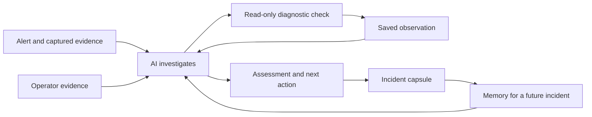

# Observability With Memory

**FCAPSule gives an existing observability stack an AI investigator with incident memory.** It connects alerts, logs, metrics and workload configuration so engineers can follow evidence across systems and draw on what happened before.

When an incident starts, the questions arrive together: What is affected? What could explain it? What should we check next? Have we seen this before? FCAPSule gives an AI investigator access to selected telemetry and bounded diagnostic tools to help answer those questions. It preserves the evidence and the investigation in a capsule that the model can remember and consult when a related incident returns.

Your existing tools supply the signals. FCAPSule gives the investigation continuity: across data sources, across responders and across recurring incidents. That is the product shift: an alert is no longer just an entry point into several dashboards; it becomes a reviewable, retained body of operational knowledge.

**Investigate with context. Respond with evidence. Remember what happened.**

## Give your monitoring team an investigator that remembers

An engineer responding to an alert needs to make decisions while the environment is changing. A workload may restart, a configuration may change, and the observation that explains the problem may be spread across several tools. This is especially consequential for monitoring teams that can access observability systems but do not own the applications they watch.

FCAPSule connects Prometheus alerts and metrics, OpenSearch logs and supported Kubernetes workload configuration in an incident workspace. Its AI can select a diagnostic check, inspect the returned observations, compare possible explanations and recommend a next step. The engineer can see what it checked and open the evidence behind the assessment.

The practical value is a stronger starting point for troubleshooting: the affected workload, the observed symptoms, a proposed explanation with supporting evidence, and a check that could confirm or weaken that explanation. When the available data cannot establish a cause, the investigation identifies what remains unknown.

And when an eligible matching incident returns, **the model remembers**. It can consult a previous capsule and bring retained observations into the current investigation. An earlier incident becomes a source of evidence for today's decision.

## A working relationship with your observability stack

FCAPSule builds on the sources your team already uses. Prometheus supplies alert conditions and performance signals. OpenSearch supplies the incident's log window. Kubernetes supplies supported workload state and configuration facts. FCAPSule connects those perspectives around the incident and preserves the selected evidence.

| The responder's question | What FCAPSule contributes |
|---|---|
| What is happening, and where? | Affected resources, namespaces, captured alerts and supported measurements around the incident. |
| What could explain these symptoms? | An AI assessment grounded in selected observations, with competing explanations and uncertainty where available. |
| What should I check next? | A proposed diagnostic action and the observation that would support or weaken the explanation. |
| Have we seen this before? | Recurrence records and bounded comparisons with eligible earlier capsules. |
| Can someone else review the investigation? | Saved checks, evidence references, an incident timeline and an exportable capsule. |
| What survives when the source data expires? | The observations and investigative records retained in FCAPSule under its own retention policy. |

This gives observability a longer working life: a captured observation can support the immediate investigation, a later review and a future recurrence.

## AI directs the investigation

The model has an active role in deciding which supported observation to request next. Depending on the available evidence, it can examine resource history, look for relevant log patterns, inspect workload configuration, compare a baseline, investigate a declared dependency or consult an earlier incident.

The investigation activity shows the questions asked, the observations returned and the checks completed. Citations let the responder inspect the source material behind the answer. Token usage is available alongside the investigation so the team can understand its model consumption.

The workflow is bounded and read-only. The engineer retains control over operational changes. The number of checks, evidence supplied to the model and model usage are limited; an investigation may finish with an explicit gap rather than a confirmed explanation.

## Capsules are the model's incident memory

A capsule preserves selected evidence and the recorded investigation: representative log patterns, captured metric facts, supported configuration observations, completed checks and assessment provenance. Its value comes from keeping these pieces connected to the incident they explain.

When a suitable earlier capsule is available, the model can remember the event through those observations and compare them with the current evidence. A repeated alert becomes an opportunity to investigate whether the same mechanism is present, or whether familiar symptoms now point somewhere else.

The Patterns view makes recurrence visible through occurrence counts, affected resources, first and latest observations, and observed intervals. Engineers can move from the pattern to the episodes behind it. Shared-condition cues can also draw attention to related operational context without establishing a common cause on their own.

Today, historical candidate selection uses the same application, resource identity and normalized alert identity. It is deliberately scoped; it does not yet recognize every similar failure across different or replacement workloads. The AI can inspect a bounded earlier capsule, and earlier model conclusions remain distinct from the evidence supporting them.

In product terms, **the model remembers through its capsules**. Technically, FCAPSule retrieves retained observations into the model's context. It does not update model weights. A larger history creates more opportunities for a useful comparison; improved diagnostic accuracy must still be demonstrated through evaluation.

## The engineer can add the missing piece

Some of the most useful evidence starts with a person: a screenshot from an external dashboard, an observation made during a deployment, or a short spoken account of what changed.

FCAPSule lets the responder add that evidence to the incident. With the optional specialist models configured, image analysis extracts observations from an uploaded screenshot and speech recognition transcribes an audio note. The primary investigator can then use the added information in an updated assessment.

This keeps the engineer involved in the investigation. A screenshot can contribute a target state or visible configuration detail that the connected sources did not capture. A note can identify a change worth checking. The evidence remains attributable to the operator and does not automatically become proof of causality.

The models have complementary jobs: the primary model directs the investigation and evaluates observations; vision and speech models make additional operator evidence usable within that same workflow.

## What the experience looks like

These screenshots show the current product using synthetic Kubernetes Lab incidents. They illustrate the workflow, not measured telecom production outcomes.

### Start with the decision

The incident overview brings the explanation, supporting observations, next check and relevant performance signal into one workspace. The responder can start with the assessment and inspect the underlying evidence as needed.

### Inspect the AI's work

The investigation view records diagnostic questions and completed checks, including an earlier retained episode where available. Engineers can review the observations used to reach the assessment.

### Recognize a returning problem

The Patterns view puts repeated issues and their observed intervals in context, with paths back to the retained episodes.

## When a familiar alert returns

Consider a Prometheus scrape-failure alert. The signal establishes a loss of telemetry, but the responder still needs to distinguish among an unavailable exporter, an incorrect endpoint, a discovery mismatch and other possible explanations.

FCAPSule captures the available alert evidence and supported condition history. Its investigation can examine workload state, available discovery/configuration facts and relevant logs. An engineer can add a screenshot from Prometheus to show a target detail that was missing from the original capture.

If an eligible earlier episode exists, the model can compare the retained observations with the current incident. It might find a matching configuration discrepancy, a meaningful difference, or insufficient evidence to connect them. The useful result is an explanation tied to observations and a next check that helps the engineer decide what to do.

Weeks later, the earlier capsule can still contribute even if the original source window has expired, provided FCAPSule has retained it. The investigation carries forward the evidence that was captured at the time.

## Memory beyond the retention window

Retention is one of the strongest consequences of this design. A team's ability to revisit an incident can extend beyond the searchable lifetime of its original telemetry.

Logs and metric samples may expire while an intermittent issue is still being investigated. FCAPSule preserves selected incident evidence early, and its retained-only review can use saved observations without querying the live telemetry sources. It can also reuse completed source checks from an eligible previous capsule.

This preserves continuity for later troubleshooting and incident review. It does not reconstruct uncaptured or deleted data. The capsule must contain the relevant observation and remain within FCAPSule's own retention policy; retained-only AI review still requires the configured model provider.

### The opportunity at telecom scale

For teams processing terabytes per day, incident memory also opens a storage strategy worth evaluating: retain selected incident evidence for longer while reducing raw retention where operational and organizational requirements allow it.

At a steady **10 TB/day**, a simplified change from **90 days to 30 days** of raw retention changes the logical retained volume from **900 TB to 300 TB**. That is **600 TB less**, or approximately **66.7% less raw volume**. This illustrates the scale of the opportunity; it is not a measured FCAPSule saving. Indexes, replicas, compression, backups and storage pricing affect the actual financial outcome.

FCAPSule does not change source retention policies automatically. A team must first verify that the retained incident evidence supports its investigation needs. The storage comparison must include FCAPSule's own state: both the exported capsule and bounded staged source captures, which currently follow the incident cleanup lifecycle.

The immediate benefit is continuity of investigation. Reduced raw-retention cost is a potential additional benefit that can be measured against it.

## Why this combination matters

FCAPSule brings AI orchestration, observations from several telemetry sources, operator-supplied evidence and retained incident memory into one workflow. The capsule connects these capabilities: it records what the investigator could observe and gives a future investigation something concrete to revisit.

The product's value is especially clear in environments with recurring failures, changing workloads and high telemetry volume. Engineers can consult an investigation that already contains selected context, inspect its supporting evidence and contribute what the automated sources missed.

**FCAPSule strengthens observability by giving the investigation a memory.** As an open-source project, it also lets teams inspect how evidence is selected, how diagnostic access is bounded and how retained observations reach the model. This is a distinctive combination, not a claim that no other product has related capabilities.

## The product pitch

**FCAPSule turns alerts into investigations that can be revisited. Its AI follows selected evidence across logs, metrics and configuration, asks bounded diagnostic questions and saves what it learned in an incident capsule. When a related problem returns, the investigator can remember the earlier observations, even if the original source window has expired. The engineer gets an explanation to test, a next step to take and a record that remains inspectable.**

---

## Further reading

- [Current product overview](../README.md)
- [Operations and user workflow](operations.md)
- [AI investigation techniques and limits](ai_investigation_techniques.md)
- [Historical capsule retrieval](historical_capsule_retrieval.md)
- [Privacy, storage and retention](data_privacy.md)
